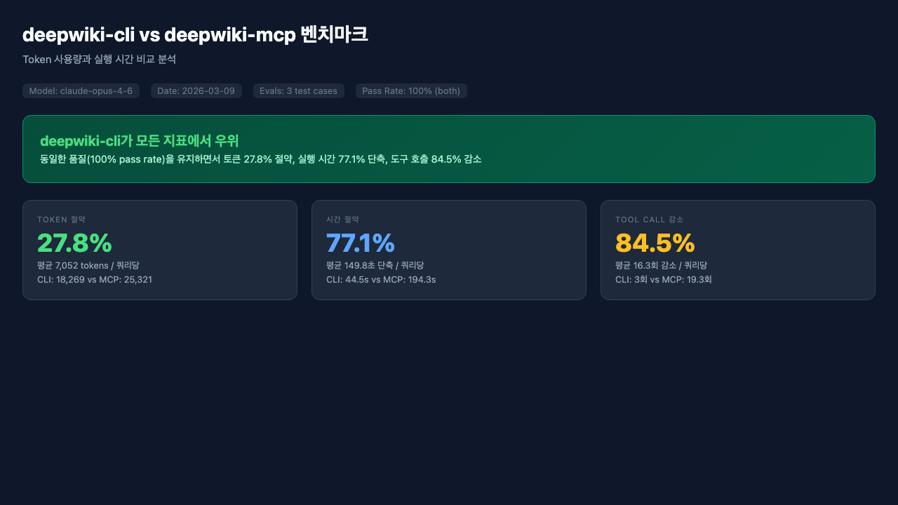
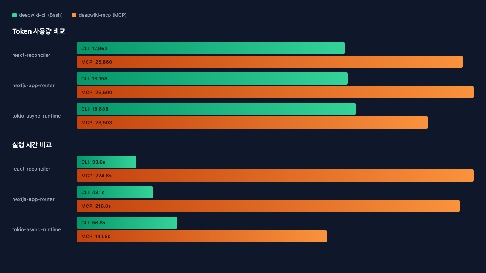
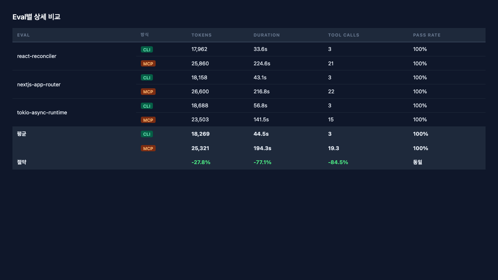

# kit

> [Claude Code](https://claude.ai/code)를 위한 커뮤니티 플러그인 & 스킬 마켓플레이스

[](https://opensource.org/licenses/MIT)
[](docs/contributors/contributing.md)

[English](./README.md)

---

## 플러그인 사용하기

### 1단계: kit 마켓플레이스 등록

```bash
claude plugin marketplace add https://github.com/hamsurang/kit
```

### 2단계: 플러그인 탐색

```bash
# 마켓플레이스의 전체 플러그인 목록 보기
claude plugin list

# 키워드로 검색
claude plugin search <키워드>
```

### 3단계: 플러그인 설치

```bash
claude plugin install <플러그인-이름>
```

예시:

```bash
claude plugin install vitest
```

### 플러그인 업데이트

```bash
# 특정 플러그인 업데이트
claude plugin update <플러그인-이름>

# 마켓플레이스 전체 갱신
claude plugin marketplace update hamsurang/kit
```

마켓플레이스 등록 없이 스킬만 설치하려면:

```bash
npx skills add hamsurang/kit
```

→ [전체 설치 가이드](docs/users/getting-started.md)

---

## 플러그인 만들기

대화형으로 새 플러그인 스캐폴딩:

```bash
git clone https://github.com/hamsurang/kit
cd kit
bash scripts/scaffold-plugin.sh
```

→ [기여 가이드](docs/contributors/contributing.md) · [플러그인 스펙](docs/contributors/plugin-spec.md)

---

## 플러그인 & 스킬 목록

| 플러그인 | 설명 | 작성자 |
| --------- | ------ | -------- |
| [vitest](./plugins/vitest) | Vite 기반 프로젝트에서 Vitest 테스트 작성, 디버깅, 설정을 지원하는 자동 활성화 스킬 | [minsoo.web](https://github.com/minsoo-web) |
| [skill-review](./plugins/skill-review) | SKILL.md를 베스트 프랙티스 기준으로 리뷰하고 pass/fail 리포트를 생성하는 슬래시 커맨드 스킬 | [minsoo.web](https://github.com/minsoo-web) |
| [gh-cli](./plugins/gh-cli) | gh CLI로 GitHub 작업을 수행할 때 자동으로 활성화되는 스킬 | [minsoo.web](https://github.com/minsoo-web) |
| [personal-tutor](./plugins/personal-tutor) | 세션 간 학습자 프로필과 지식 그래프를 유지하는 적응형 기술 튜터링 스킬 | [minsoo.web](https://github.com/minsoo-web) |
| [deepwiki-cli](./plugins/deepwiki-cli) | MCP 토큰 오버헤드 없이 DeepWiki CLI로 GitHub 저장소 위키를 조회하는 스킬 | [minsoo.web](https://github.com/minsoo-web) |
| [obsidian](./plugins/obsidian) | Obsidian 볼트에서 노트 검색, 생성, 편집, 정리 및 obsidian-cli와 Obsidian Headless를 통한 프론트매터 관리 | [minsoo.web](https://github.com/minsoo-web) |
| [library-analyzer](./plugins/library-analyzer) | 병렬 에이전트를 활용하여 오픈소스 라이브러리의 기여 준비도를 분석하는 스킬 | [minsoo.web](https://github.com/minsoo-web) |
| [obsidian-brain](./plugins/obsidian-brain) | Claude Code 세션의 학습 내용을 Obsidian 볼트에 제텔카스텐 노트로 아카이빙하고 볼트 지식을 대화 컨텍스트로 활용하는 스킬 | [minsoo.web](https://github.com/minsoo-web) |

*플러그인을 기여하고 싶으신가요? [기여 방법](docs/contributors/contributing.md)을 확인하세요.*

---

## 벤치마크: deepwiki-cli vs DeepWiki MCP

`deepwiki-cli` 플러그인은 MCP 프로토콜 대신 Rust CLI 바이너리를 사용하여 토큰과 시간을 크게 절약합니다.







> 3개 쿼리(React Reconciler, Next.js App Router, Tokio Async Runtime)로 테스트. CLI 방식은 단일 `deepwiki-cli ask` Bash 호출을 사용하고, MCP 방식은 Streamable HTTP를 통한 3단계 프로토콜(initialize → tools/list → tools/call)을 수행합니다.

---

## 보안 안내

kit은 플러그인을 별도로 감사하거나 샌드박스 처리하지 않습니다. 특히 `.mcp.json`과 셸 커맨드가 포함된 플러그인은 설치 전 반드시 내용을 검토하세요. 신뢰할 수 있는 작성자의 플러그인만 설치하시기 바랍니다.

## 라이선스

MIT — [LICENSE](./LICENSE) 참고
