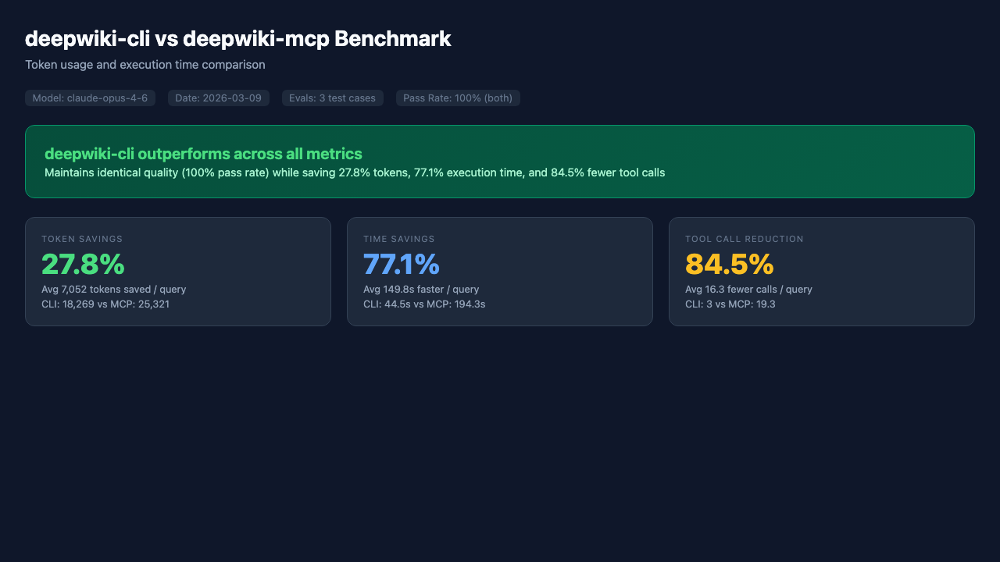
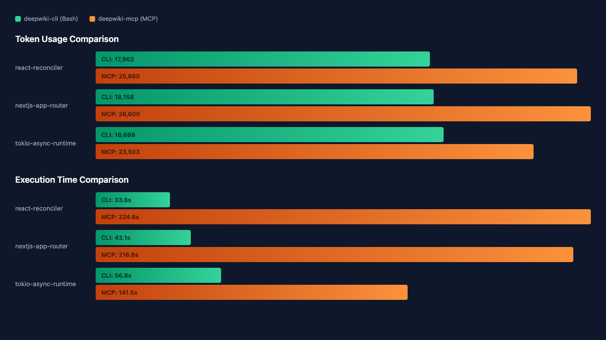
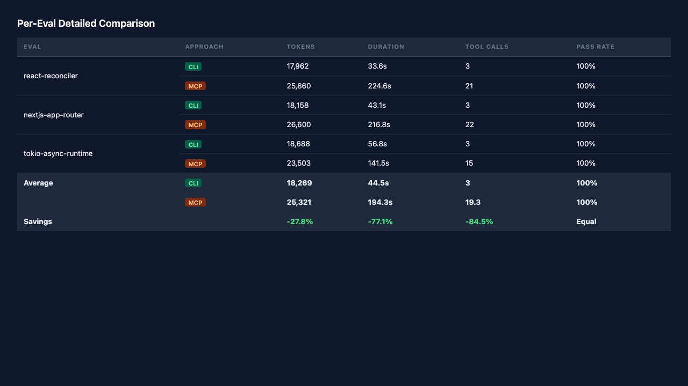

# kit

> A community-driven plugin & skills marketplace for [Claude Code](https://claude.ai/code)

[](https://opensource.org/licenses/MIT)
[](docs/contributors/contributing.md)

[한국어](./README.ko.md)

---

## Using Plugins

### Step 1: Add the kit marketplace

```bash
claude plugin marketplace add https://github.com/hamsurang/kit
```

### Step 2: Browse available plugins

```bash
# List all plugins from the marketplace
claude plugin list

# Search by keyword
claude plugin search <keyword>
```

### Step 3: Install a plugin

```bash
claude plugin install <plugin-name>
```

Example:

```bash
claude plugin install vitest
```

### Updating plugins

```bash
# Update a specific plugin
claude plugin update <plugin-name>

# Refresh all plugins from the marketplace
claude plugin marketplace update hamsurang/kit
```

Or install individual skills without adding the marketplace:

```bash
npx skills add hamsurang/kit
```

→ [Full installation guide](docs/users/getting-started.md)

---

## Building Plugins

Scaffold a new plugin interactively:

```bash
git clone https://github.com/hamsurang/kit
cd kit
bash scripts/scaffold-plugin.sh
```

→ [Contributing guide](docs/contributors/contributing.md) · [Plugin spec](docs/contributors/plugin-spec.md)

---

## Plugin & Skills Directory

| Plugin | Description | Author |
| -------- | ----------- | -------- |
| [vitest](./plugins/vitest) | Auto-invoked skill for writing, debugging, and configuring Vitest tests in Vite-based projects | [minsoo.web](https://github.com/minsoo-web) |
| [skill-review](./plugins/skill-review) | Slash-command skill that reviews any SKILL.md against best practices and outputs a structured pass/fail report | [minsoo.web](https://github.com/minsoo-web) |
| [gh-cli](./plugins/gh-cli) | Auto-invoked skill for working with GitHub from the command line using the gh CLI tool | [minsoo.web](https://github.com/minsoo-web) |
| [personal-tutor](./plugins/personal-tutor) | Adaptive technical tutoring skill that builds a persistent knowledge graph and learner profile across sessions | [minsoo.web](https://github.com/minsoo-web) |
| [deepwiki-cli](./plugins/deepwiki-cli) | Query GitHub repository wikis via DeepWiki CLI without MCP token overhead. | [minsoo.web](https://github.com/minsoo-web) |
| [obsidian](./plugins/obsidian) | Work with Obsidian vaults — search, create, edit, organize notes and manage frontmatter via obsidian-cli and Obsidian Headless | [minsoo.web](https://github.com/minsoo-web) |
| [library-analyzer](./plugins/library-analyzer) | Analyze open-source libraries for contribution readiness with parallel agents | [minsoo.web](https://github.com/minsoo-web) |
| [obsidian-brain](./plugins/obsidian-brain) | Archive learnings from Claude Code sessions to Obsidian vault as Zettelkasten notes and use vault knowledge as conversational context | [minsoo.web](https://github.com/minsoo-web) |

*Have a plugin to share? See [Contributing](docs/contributors/contributing.md).*

---

## Benchmark: deepwiki-cli vs DeepWiki MCP

The `deepwiki-cli` plugin uses a Rust CLI binary instead of the MCP protocol, delivering significant token and time savings.







> Tested with 3 queries (React Reconciler, Next.js App Router, Tokio Async Runtime). CLI approach uses a single `deepwiki-cli ask` Bash call; MCP approach performs the full 3-step protocol (initialize → tools/list → tools/call) via Streamable HTTP.

---

## Security Notice

kit does not audit or sandbox plugins. Review any plugin — especially `.mcp.json` and shell commands — before installing. Only install from authors you trust.

## License

MIT — see [LICENSE](./LICENSE)
